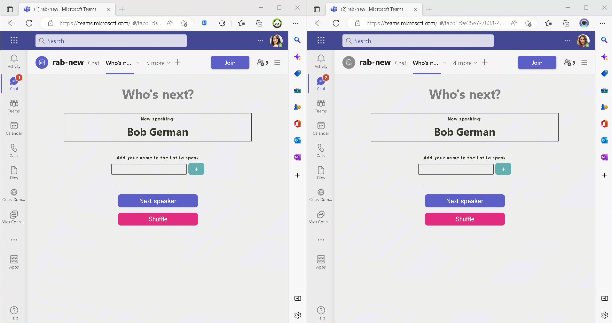

# How to use this Who's Next In-meeting app

## Summary

🧑‍💻👩🏽‍💻 This project was created as part of FHL, a week dedicated to Fixing, Hacking and Learning something new together.

❓ The Microsoft 365 Cloud Advocates always had a challenge in their weekly sync meetings: They could not decide on **who's next** to give an update on project progress.

🚀So [Bob German](https://github.com/BobGerman) and [Rabia Williams](https://github.com/rabwill) decided to take the necessary step, cloud 🥑 style, to create a meeting app called "Who's next" which will help choose attendees from a meeting.
👀 Here is a quick look of how the app works!

⚙️They used [Teams Toolkit](https://learn.microsoft.com/en-us/microsoftteams/platform/toolkit/teams-toolkit-fundamentals?pivots=visual-studio-code), a VS Code extension to create their base teams app from a sample meeting app available in the toolkit itself.
Then they used [Fluid Framework](https://fluidframework.com/docs/) to synchronize the view for each attendee. 

⚠️This app doesn't require any Azure AD permission; if you can upload a Teams app, you can run this. It does require deploying a service in Azure.
## Prerequisites

- [NodeJS](https://nodejs.org/en/)
- A Microsoft 365 tenant in which you are an administrator. Please don't test in production; you can get a free Microsoft 365 developer tenant by joining the [Microsoft 365 developer program](https://developer.microsoft.com/en-us/microsoft-365/dev-program)
- [Teams Toolkit Visual Studio Code Extension](https://aka.ms/teams-toolkit)

## Version history

Version|Date|Author|Comments
-------|----|----|--------
1.0|November 21, 2022|Bob German and Rabia Williams|Initial release

## Disclaimer

**THIS CODE IS PROVIDED *AS IS* WITHOUT WARRANTY OF ANY KIND, EITHER EXPRESS OR IMPLIED, INCLUDING ANY IMPLIED WARRANTIES OF FITNESS FOR A PARTICULAR PURPOSE, MERCHANTABILITY, OR NON-INFRINGEMENT.**

---

## This demo illustrates

- Use of Teams Toolkit to create a simple meeting tab application
- Use of Fluid framework to synchronize the contents of a meeting tab
- Creating and saving a Fluid Relay Service container in the tab configuration page

WARNING: For simplicity, this sample uses the **InsecureTokenProvider** class to communicate with the Fluid Relay Service. This class should not be used in production; see [this page](https://fluidframework.com/docs/apis/test-client-utils/insecuretokenprovider-class/) for details.

## Minimal Path to Awesome

### Provision an Azure Fluid Relay Service

This application displays the same list of speakers to all meeting attendees with real-time updates. The Fluid Framework makes this easy, but to use it you need to provision an instance of the Azure Fluid Relay service somewhere in Azure.

For complete instructions, see [this How to article](https://learn.microsoft.com/azure/azure-fluid-relay/how-tos/provision-fluid-azure-portal).

When you're finished deploying the service, go to the Access Key tab and copy down the tenant ID, primary key, and service endpoint URL and save them for when you configure your application.

> Note: Provision Azure cloud resources and deploy to Azure may cause charges to your Azure Subscription.

### Prepare a meeting

Follow the instruction to [create a meeting in Teams](https://support.microsoft.com/en-us/office/create-a-meeting-in-teams-for-personal-and-small-business-use-eb571219-517b-49bf-afe1-4fff091efa85). Then in the Calendar you can find the meeting you just created. Double click the meeting will open the meeting details, and will enable the meeting app to be added in this meeting in later steps.

### Run the app locally

- Add the Fluid Relay Service details into your /src/tabs/.env.teamsfx.local file:

~~~text
REACT_APP_FLUID_CONNECTION_TYPE=remote
REACT_APP_FLUID_REMOTE_TENANT_ID=(your tenant ID)
REACT_APP_FLUID_REMOTE_PRIMARY_KEY=(your primary key)
REACT_APP_FLUID_REMOTE_ENDPOINT=(your endpoint URL)
~~~

- In Visual Studio Code: Start debugging the project by hitting the `F5` key in your keyboard. 
  - Alternatively open the `Run and Debug Activity` panel(Ctrl+Shift+D) in Visual Studio Code and click the `Run and Debug` green arrow button.
- The Teams web client will launch in your browser, click the small arrow sit aside the `Add` button and select `Add to a meeting`, then select the meeting you just created. 
- Click `Set up a tab` in the next step, it will take you to the meeting configuration page.
- In the configuration page, click `Save`, this may take several minutes, and then you will see the meeting chat tab.
- Click `Join` to join the meeting.
- Select the tab (default name is `My Tab`) in the bar, you will see a side panel tab in the meeting.

### Deploy the app to Azure

Deploy your project to Azure by following these steps:

- Add the Fluid Relay Service details into your /src/tabs/.env.teamsfx.dev file:

~~~text
REACT_APP_FLUID_CONNECTION_TYPE=remote
REACT_APP_FLUID_REMOTE_TENANT_ID=(your tenant ID)
REACT_APP_FLUID_REMOTE_PRIMARY_KEY=(your primary key)
REACT_APP_FLUID_REMOTE_ENDPOINT=(your endpoint URL)
~~~

- Open Teams Toolkit in Visual Studio Code, and sign in your Azure account by clicking the `Sign in to Azure` in the `ACCOUNTS` section from sidebar.
- After you signed in, select a subscription under your account. The Teams Toolkit will use this subscription to provision Azure resources to host you app.
- Open the Teams Toolkit and click `Provision in the cloud` in the `DEVELOPMENT` section.
  - Alternatively open the command palette(Ctrl+Shift+P) and type: `Teams: Provision in the cloud` command.
- Open the Teams Toolkit and click `Deploy to the cloud` in the `DEVELOPMENT` section.
  - Alternatively open the command palette(Ctrl+Shift+P) and type: `Teams: Deploy to the cloud` command.

> Note: Provision Azure cloud resources and deploy to Azure may cause charges to your Azure Subscription.

### Preview the app in Teams client

After you have completed the provision and deploy steps in `Deploy the app to Azure` section, you can preview your app in Teams client by following steps below:

- In Visual Studio Code

  1. Open the `Run and Debug Activity` panel from sidebar, or use short key Ctrl+Shift+D.
  1. Select `Launch Remote (Edge)` or `Launch Remote (Chrome)` in the launch configuration (a dropdown selection in the upper-left corner).
  1. Press the `Start Debugging` (small green arrow) button to launch your app, the Teams web client will be automatically opened in your browser, where you will see your app running remotely from Azure.

